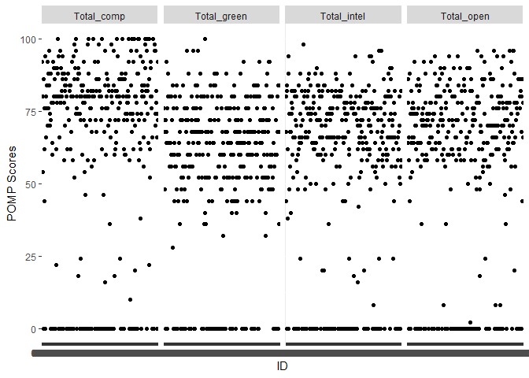
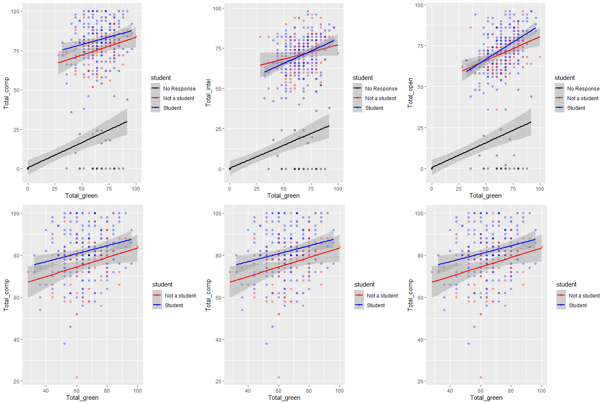

HW3
================
han
2/19/2021

# Homework 03

\#\#\#You will analyze data looking at the relationship between **green
reputation** and three personality traits–**compassion**, **intellectual
curiosity**, and **openness to experiences**. The dataset includes data
from **students** and **non-students**.

``` r
dictionary <- readr::read_csv("green_dictionary.csv")
```

    ## 
    ## -- Column specification --------------------------------------------------------
    ## cols(
    ##   Item = col_character(),
    ##   Content = col_character(),
    ##   Options = col_character(),
    ##   Keying = col_double()
    ## )

``` r
green_data <- readr::read_csv("green_data.csv")
```

    ## 
    ## -- Column specification --------------------------------------------------------
    ## cols(
    ##   .default = col_double(),
    ##   id = col_character()
    ## )
    ## i Use `spec()` for the full column specifications.

\#\#For your assignment, do the following.

### 1\. Inspect the item responses (e.g., with graphs or by summarizing distinct values).

``` 
 Is anything unusual?
 
```

``` r
green_data %>% #Summarizes data for each column by max value and min value.
  summarize(across(c(green1:student),
                      list(Max=~max(.x, na.rm = TRUE),
                        Min=~min(.x, na.rm = TRUE))))
```

    ## # A tibble: 1 x 72
    ##   green1_Max green1_Min green2_Max green2_Min green3_Max green3_Min green4_Max
    ##        <dbl>      <dbl>      <dbl>      <dbl>      <dbl>      <dbl>      <dbl>
    ## 1          5          1          5          1          5          1          5
    ## # ... with 65 more variables: green4_Min <dbl>, green5_Max <dbl>,
    ## #   green5_Min <dbl>, comp1_Max <dbl>, comp1_Min <dbl>, comp2_Max <dbl>,
    ## #   comp2_Min <dbl>, comp3_Max <dbl>, comp3_Min <dbl>, comp4_Max <dbl>,
    ## #   comp4_Min <dbl>, comp5_Max <dbl>, comp5_Min <dbl>, comp6_Max <dbl>,
    ## #   comp6_Min <dbl>, comp7_Max <dbl>, comp7_Min <dbl>, comp8_Max <dbl>,
    ## #   comp8_Min <dbl>, comp9_Max <dbl>, comp9_Min <dbl>, comp10_Max <dbl>,
    ## #   comp10_Min <dbl>, intel1_Max <dbl>, intel1_Min <dbl>, intel2_Max <dbl>,
    ## #   intel2_Min <dbl>, intel3_Max <dbl>, intel3_Min <dbl>, intel4_Max <dbl>,
    ## #   intel4_Min <dbl>, intel5_Max <dbl>, intel5_Min <dbl>, intel6_Max <dbl>,
    ## #   intel6_Min <dbl>, intel7_Max <dbl>, intel7_Min <dbl>, intel8_Max <dbl>,
    ## #   intel8_Min <dbl>, intel9_Max <dbl>, intel9_Min <dbl>, intel10_Max <dbl>,
    ## #   intel10_Min <dbl>, open1_Max <dbl>, open1_Min <dbl>, open2_Max <dbl>,
    ## #   open2_Min <dbl>, open3_Max <dbl>, open3_Min <dbl>, open4_Max <dbl>,
    ## #   open4_Min <dbl>, open5_Max <dbl>, open5_Min <dbl>, open6_Max <dbl>,
    ## #   open6_Min <dbl>, open7_Max <dbl>, open7_Min <dbl>, open8_Max <dbl>,
    ## #   open8_Min <dbl>, open9_Max <dbl>, open9_Min <dbl>, open10_Max <dbl>,
    ## #   open10_Min <dbl>, student_Max <dbl>, student_Min <dbl>

``` r
filter(green_data, id == 5549) #Searches id for value "5549" 
```

    ## # A tibble: 2 x 37
    ##   id    green1 green2 green3 green4 green5 comp1 comp2 comp3 comp4 comp5 comp6
    ##   <chr>  <dbl>  <dbl>  <dbl>  <dbl>  <dbl> <dbl> <dbl> <dbl> <dbl> <dbl> <dbl>
    ## 1 5549       3      4      4      4      3     4     2     4     4     4     4
    ## 2 5549       4      2      4      3      4     4     5     4     5     5     1
    ## # ... with 25 more variables: comp7 <dbl>, comp8 <dbl>, comp9 <dbl>,
    ## #   comp10 <dbl>, intel1 <dbl>, intel2 <dbl>, intel3 <dbl>, intel4 <dbl>,
    ## #   intel5 <dbl>, intel6 <dbl>, intel7 <dbl>, intel8 <dbl>, intel9 <dbl>,
    ## #   intel10 <dbl>, open1 <dbl>, open2 <dbl>, open3 <dbl>, open4 <dbl>,
    ## #   open5 <dbl>, open6 <dbl>, open7 <dbl>, open8 <dbl>, open9 <dbl>,
    ## #   open10 <dbl>, student <dbl>

Dataset has several issues. 1. Duplicate participant data 2. Certain
data values are off (e.g., -99)

### 2\. Compute total scores for the four scales.

``` 
 Recode variables as needed.
 
```

``` r
temp_recode = dictionary %>% #Temporary array of names to be used later
  pull(Item) #Array of names are pulled from the list of values under the "item" column

Q2set=green_data %>% #Dataset for Q2, recodes original dataset "green_data"
  mutate(across(all_of(temp_recode), #Recodes across all the columns that match the temp_recode list
           ~na_if(.x,-99))) %>% #All values that are -99 are recoded into NA
  mutate(id2=ifelse(duplicated(id),paste0(id, "r"), id)) #Creates new id list and discriminates repeated ID numbers

Q2set %>% #Rechecking quick summary glance
  summarize(across(c(green1:student),
                      list(Max=~max(.x, na.rm = TRUE),
                        Min=~min(.x, na.rm = TRUE))))
```

    ## # A tibble: 1 x 72
    ##   green1_Max green1_Min green2_Max green2_Min green3_Max green3_Min green4_Max
    ##        <dbl>      <dbl>      <dbl>      <dbl>      <dbl>      <dbl>      <dbl>
    ## 1          5          1          5          1          5          1          5
    ## # ... with 65 more variables: green4_Min <dbl>, green5_Max <dbl>,
    ## #   green5_Min <dbl>, comp1_Max <dbl>, comp1_Min <dbl>, comp2_Max <dbl>,
    ## #   comp2_Min <dbl>, comp3_Max <dbl>, comp3_Min <dbl>, comp4_Max <dbl>,
    ## #   comp4_Min <dbl>, comp5_Max <dbl>, comp5_Min <dbl>, comp6_Max <dbl>,
    ## #   comp6_Min <dbl>, comp7_Max <dbl>, comp7_Min <dbl>, comp8_Max <dbl>,
    ## #   comp8_Min <dbl>, comp9_Max <dbl>, comp9_Min <dbl>, comp10_Max <dbl>,
    ## #   comp10_Min <dbl>, intel1_Max <dbl>, intel1_Min <dbl>, intel2_Max <dbl>,
    ## #   intel2_Min <dbl>, intel3_Max <dbl>, intel3_Min <dbl>, intel4_Max <dbl>,
    ## #   intel4_Min <dbl>, intel5_Max <dbl>, intel5_Min <dbl>, intel6_Max <dbl>,
    ## #   intel6_Min <dbl>, intel7_Max <dbl>, intel7_Min <dbl>, intel8_Max <dbl>,
    ## #   intel8_Min <dbl>, intel9_Max <dbl>, intel9_Min <dbl>, intel10_Max <dbl>,
    ## #   intel10_Min <dbl>, open1_Max <dbl>, open1_Min <dbl>, open2_Max <dbl>,
    ## #   open2_Min <dbl>, open3_Max <dbl>, open3_Min <dbl>, open4_Max <dbl>,
    ## #   open4_Min <dbl>, open5_Max <dbl>, open5_Min <dbl>, open6_Max <dbl>,
    ## #   open6_Min <dbl>, open7_Max <dbl>, open7_Min <dbl>, open8_Max <dbl>,
    ## #   open8_Min <dbl>, open9_Max <dbl>, open9_Min <dbl>, open10_Max <dbl>,
    ## #   open10_Min <dbl>, student_Max <dbl>, student_Min <dbl>

``` r
reverse_recode = dictionary %>% #Separate temporary array of names to be used later
  filter(Keying == -1 | Keying ==-2) %>% #Filters the list by the reverse codes (based off dictionary)
  pull(Item)    

Q2set.1 = Q2set%>% #New dataset with reverse coding 
  mutate(
    across(all_of(reverse_recode),
           ~recode(.x,"5" = 1, "4" = 2, "3" = 3, "2" = 4, "1" = 5))) #Reverse codes based off the dictionary (reverse_recode)

Q2set.1 %>% #Print out summary statistics
  rowwise() %>% #By row
  group_by(id2) %>% #By id
  mutate(Total_green=sum(c_across(green1:green5), na.rm = TRUE), #Summary statistics - sum of all green (20), comp (50), intel (50) and open(50)
         Total_comp=sum(c_across(comp1:comp10), na.rm = TRUE),
         Total_intel=sum(c_across(intel1:intel10), na.rm = TRUE),
         Total_open=sum(c_across(open1:open10), na.rm = TRUE))%>% 
  select(id2,Total_green,Total_comp,Total_intel,Total_open)
```

    ## # A tibble: 373 x 5
    ## # Groups:   id2 [373]
    ##    id2   Total_green Total_comp Total_intel Total_open
    ##    <chr>       <dbl>      <dbl>       <dbl>      <dbl>
    ##  1 9099           20         37          28         35
    ##  2 6275           11         48          35         31
    ##  3 8116           20         44          36         39
    ##  4 8586           19         46          30         39
    ##  5 0406           19         40          37         37
    ##  6 5645           18         42          38         38
    ##  7 3788            9         30          30         30
    ##  8 8424           13         19          43         18
    ##  9 8450           18         42          40         39
    ## 10 0512           22         38          37         38
    ## # ... with 363 more rows

### 3\. Rescale the variables so that they go from 0-100 instead of the original range.

``` 
 Name the recaled variables `*_pomp`.
```

``` r
Q3set= Q2set.1%>% #Dataset for Q3
  mutate(across(c(green1:green5), #Change for green data
           ~.x * 4, #Multiply green data by 4 (Total equals 100)
           .names="{.col}_pomp")) %>% #creates new columns for ^^ named *column*_pomp 
  mutate(across(c(comp1:open10),
           ~.x * 2, #Same as before but multiply rest by 2 (Total equal 100)
           .names="{.col}_pomp"))

Q3set_Final=Q3set %>% #Create summary table for question (Same as Q2set.1 but with 100 as total)
  rowwise() %>%
  group_by(id2) %>% 
  mutate(Total_green=sum(c_across(green1_pomp:green5_pomp), na.rm = TRUE),
         Total_comp=sum(c_across(comp1_pomp:comp10_pomp), na.rm = TRUE),
         Total_intel=sum(c_across(intel1_pomp:intel10_pomp), na.rm = TRUE),
         Total_open=sum(c_across(open1_pomp:open10_pomp), na.rm = TRUE)) %>% 
  select(id2,Total_green,Total_comp,Total_intel,Total_open,student)

Q3set_Final
```

    ## # A tibble: 373 x 6
    ## # Groups:   id2 [373]
    ##    id2   Total_green Total_comp Total_intel Total_open student
    ##    <chr>       <dbl>      <dbl>       <dbl>      <dbl>   <dbl>
    ##  1 9099           80         74          56         70       2
    ##  2 6275           44         96          70         62       2
    ##  3 8116           80         88          72         78       2
    ##  4 8586           76         92          60         78       2
    ##  5 0406           76         80          74         74       2
    ##  6 5645           72         84          76         76       2
    ##  7 3788           36         60          60         60       2
    ##  8 8424           52         38          86         36       2
    ##  9 8450           72         84          80         78       1
    ## 10 0512           88         76          74         76       2
    ## # ... with 363 more rows

### 4\. Make plots that illustrate the distributions of the 4 POMP-scored variables.

``` r
Q4set = Q3set_Final %>% #Creates plot based off Q3
  select(id2,Total_green, Total_comp, Total_intel, Total_open) %>%
  pivot_longer(., cols = c(Total_green,Total_comp,Total_intel,Total_open), names_to = "POMP_variables", values_to = "POMP_scores") #Reformats dataset to have all the categories as a factor for easier graph

ggplot(Q4set) +
  aes(x=id2,y=POMP_scores) + 
  facet_grid(~ POMP_variables)+ #Split by POMP_variables
  geom_point() +
  scale_x_discrete("ID")+
  scale_y_continuous("POMP Scores")
```

<!-- -->

### 5\. Make scatterplots showing the relationships between **green reputation** and each personality trait.

``` 
 Include trend lines for **students** and **non-students**.
 What do these plots show?
 
```

``` r
Q5set=Q3set_Final %>% #Dataset for Q5
  mutate(
    student = recode(student, "1" = "Not a student", "2" = "Student", .default = "No Response", .missing="No Response"))#Recode to student and not a student

#These are a set of ggplots showing a scatterplot of student, not a student and no responses
a = ggplot(Q5set) +
  aes(x=Total_green,y=Total_comp, group=student, color = student) +
  geom_point(alpha = 0.3, na.rm =TRUE)+
  scale_color_manual(values=c("black", "red", "blue"))+
  geom_smooth(method = "lm")

b = ggplot(Q5set) +
  aes(x=Total_green,y=Total_intel,group=student,color = student) +
  scale_color_manual(values=c("black", "red", "blue"))+
  geom_point(alpha = 0.3, na.rm =TRUE)+
  geom_smooth(method = "lm") 

c = ggplot(Q5set) +
  aes(x=Total_green,y=Total_open,group=student,color = student) +
  scale_color_manual(values=c("black", "red", "blue"))+
  geom_point(alpha = 0.3, na.rm =TRUE)+
  geom_smooth(method = "lm")

#Same dataset as last one but removed all NA and incorrect data
Q5set.1=Q3set_Final %>% 
  mutate(student = recode(student, "1" = "Not a student", "2" = "Student"))

#Same plots as last time but without NA and incorrect data
d = ggplot(data=subset(Q5set.1, !is.na(student))) +
  aes(x=Total_green,y=Total_comp, group=student, color = student) +
  scale_color_manual(values=c("red", "blue"))+
  geom_point(alpha = 0.3, na.rm =TRUE)+
  geom_smooth(method = "lm")

e = ggplot(data=subset(Q5set.1, !is.na(student))) +
  aes(x=Total_green,y=Total_intel,group=student,color = student) +
  scale_color_manual(values=c("red", "blue"))+
  geom_point(alpha = 0.3, na.rm =TRUE)+
  geom_smooth(method = "lm") 

f = ggplot(data=subset(Q5set.1, !is.na(student))) +
  aes(x=Total_green,y=Total_open,group=student,color = student) +
  scale_color_manual(values=c("red", "blue"))+
  geom_point(alpha = 0.3, na.rm =TRUE)+
  geom_smooth(method = "lm")

grid.arrange(a,b,c,d,e,f, nrow=2)#Merges all the graphs into 1 image
```

    ## `geom_smooth()` using formula 'y ~ x'
    ## `geom_smooth()` using formula 'y ~ x'
    ## `geom_smooth()` using formula 'y ~ x'
    ## `geom_smooth()` using formula 'y ~ x'
    ## `geom_smooth()` using formula 'y ~ x'
    ## `geom_smooth()` using formula 'y ~ x'



6.  Compare **green reputation** for students and non-students using a
    **rainfall plot** (bar + density + data points).

7.  Compute a summary table of means, SDs, medians, minima, and maxima
    for the four total scores for students and non-students.

<!-- end list -->

``` r
Q5set %>%
  group_by(student) %>% 
  summarize(across(c(Total_green:Total_open),
                    list(Mu = ~mean(.x, na.rm = TRUE),
                         Sigma = ~sd(.x, na.rm=TRUE),
                         Median = ~median(.x,na.rm=TRUE),
                         Max=~max(.x, na.rm = TRUE),
                         Min=~min(.x, na.rm = TRUE))))
```

    ## # A tibble: 3 x 21
    ##   student Total_green_Mu Total_green_Sig~ Total_green_Med~ Total_green_Max
    ## * <chr>            <dbl>            <dbl>            <dbl>           <dbl>
    ## 1 No Res~           25.8             33.1                0              92
    ## 2 Not a ~           66.9             13.2               68             100
    ## 3 Student           65.1             13.7               64              96
    ## # ... with 16 more variables: Total_green_Min <dbl>, Total_comp_Mu <dbl>,
    ## #   Total_comp_Sigma <dbl>, Total_comp_Median <dbl>, Total_comp_Max <dbl>,
    ## #   Total_comp_Min <dbl>, Total_intel_Mu <dbl>, Total_intel_Sigma <dbl>,
    ## #   Total_intel_Median <dbl>, Total_intel_Max <dbl>, Total_intel_Min <dbl>,
    ## #   Total_open_Mu <dbl>, Total_open_Sigma <dbl>, Total_open_Median <dbl>,
    ## #   Total_open_Max <dbl>, Total_open_Min <dbl>

In your assignment, prepare an RMarkdown file that includes both the
coding and (for 4-7) narrative descriptions of your results.
