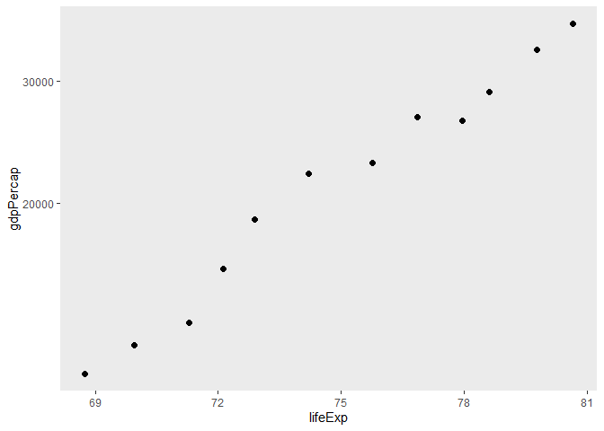
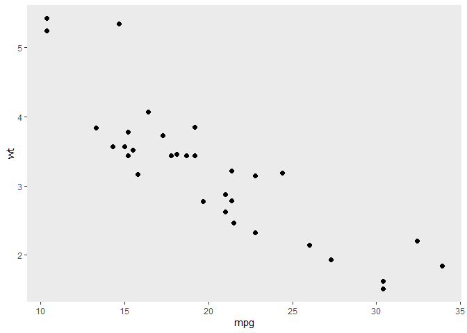
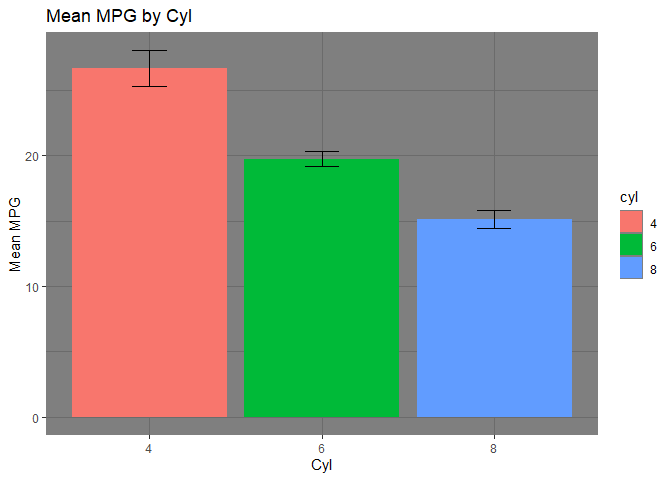

HW3
================
han
2/4/2021

## R Markdown: HW3 Exercise 1 and 2

``` r
#Exercise 1.1
#Use filter() to subset the gapminder data to three countries of your choice in the 1970’s.

Ex1.1=gapminder %>% 
  filter(country == "Mexico"& year %in% 1970:1980|country =="India"& year %in% 1970:1980|country =="China" & year %in% 1970:1980)

Ex1.1
```

    ## # A tibble: 6 x 6
    ##   country continent  year lifeExp       pop gdpPercap
    ##   <fct>   <fct>     <int>   <dbl>     <int>     <dbl>
    ## 1 China   Asia       1972    63.1 862030000      677.
    ## 2 China   Asia       1977    64.0 943455000      741.
    ## 3 India   Asia       1972    50.7 567000000      724.
    ## 4 India   Asia       1977    54.2 634000000      813.
    ## 5 Mexico  Americas   1972    62.4  55984294     6809.
    ## 6 Mexico  Americas   1977    65.0  63759976     7675.

``` r
#Exercise 1.2
#Use the pipe operator %>% to select “country” and “gdpPercap” from your filtered dataset in 1.1.

Ex1.1 %>% 
  select(country,gdpPercap)
```

    ## # A tibble: 6 x 2
    ##   country gdpPercap
    ##   <fct>       <dbl>
    ## 1 China        677.
    ## 2 China        741.
    ## 3 India        724.
    ## 4 India        813.
    ## 5 Mexico      6809.
    ## 6 Mexico      7675.

``` r
#Exercise 1.3
#Make a new variable in gapminder for the change in life expectancy from the previous measurement. Filter this table to show all of the entries that have experienced a drop in life expectancy.
#Hint: you might find the lag() or diff() functions useful.

gapminder %>% #Adding new column
  group_by(country) %>% #Makes it so changes in life expectancy are only measured by country
  mutate(ChangeInLifeExp = lifeExp-lag(lifeExp)) %>%  #ChangeinLifeExp is the current row - previous row
  filter(ChangeInLifeExp<0) #Filters changes by negative values which represents decrease in life expectancy
```

    ## # A tibble: 102 x 7
    ## # Groups:   country [52]
    ##    country  continent  year lifeExp     pop gdpPercap ChangeInLifeExp
    ##    <fct>    <fct>     <int>   <dbl>   <int>     <dbl>           <dbl>
    ##  1 Albania  Europe     1992    71.6 3326498     2497.          -0.419
    ##  2 Angola   Africa     1987    39.9 7874230     2430.          -0.036
    ##  3 Benin    Africa     2002    54.4 7026113     1373.          -0.371
    ##  4 Botswana Africa     1992    62.7 1342614     7954.          -0.877
    ##  5 Botswana Africa     1997    52.6 1536536     8647.         -10.2  
    ##  6 Botswana Africa     2002    46.6 1630347    11004.          -5.92 
    ##  7 Bulgaria Europe     1977    70.8 8797022     7612.          -0.09 
    ##  8 Bulgaria Europe     1992    71.2 8658506     6303.          -0.15 
    ##  9 Bulgaria Europe     1997    70.3 8066057     5970.          -0.87 
    ## 10 Burundi  Africa     1992    44.7 5809236      632.          -3.48 
    ## # ... with 92 more rows

``` r
#Exercise 1.4
#Filter gapminder so that it shows the max GDP per capita experienced by each country.
#Hint: you might find the max() function useful here.

gapminder %>% #Making table based on max GDP per capita by country
  group_by(country) %>% #Groups gapminder by country to isolate max gdpPer cap for each country
  filter(gdpPercap==max(gdpPercap)) #Filters only by max gdpPercap for each country
```

    ## # A tibble: 142 x 6
    ## # Groups:   country [142]
    ##    country     continent  year lifeExp       pop gdpPercap
    ##    <fct>       <fct>     <int>   <dbl>     <int>     <dbl>
    ##  1 Afghanistan Asia       1982    39.9  12881816      978.
    ##  2 Albania     Europe     2007    76.4   3600523     5937.
    ##  3 Algeria     Africa     2007    72.3  33333216     6223.
    ##  4 Angola      Africa     1967    36.0   5247469     5523.
    ##  5 Argentina   Americas   2007    75.3  40301927    12779.
    ##  6 Australia   Oceania    2007    81.2  20434176    34435.
    ##  7 Austria     Europe     2007    79.8   8199783    36126.
    ##  8 Bahrain     Asia       2007    75.6    708573    29796.
    ##  9 Bangladesh  Asia       2007    64.1 150448339     1391.
    ## 10 Belgium     Europe     2007    79.4  10392226    33693.
    ## # ... with 132 more rows

``` r
#Exercise 1.5
#Produce a scatterplot of Canada’s life expectancy vs. GDP per capita using ggplot2, without defining a new variable. That is, after filtering the gapminder data set, pipe it directly into the ggplot() function. In your plot, put GDP per capita on a log scale.

gapminder %>% #Making Scatterplot
  filter(country=="Canada") %>% 
  ggplot(aes(x=lifeExp, y=gdpPercap))+
  geom_point(size=2) + #Plots each point by life Exp and gdpPercap
  scale_y_continuous(trans='log10')+ #changes gdpPer cap scaling to log scale
  theme(panel.grid.major = element_blank(), panel.grid.minor = element_blank())
```

<!-- -->

``` r
#Exercise 2: Explore two variables with dplyr and ggplot2 Use palmerpenguins::penguins or another dataset of your choice. (Check out a dataset from the datasets R package if you want!)

#Exercise 2.1
#Pick two quantitative variables to explore.
#Make a summary table of descriptive statistics for these variables using summarize().
#Include whatever staistics you feel appropriate (mean, median sd, range, etc.).
#Make a scatterplot of these variables using ggplot().

mtcars %>% #Making summary table
  summarize(mu_mpg = mean(mpg),#Mean mpg
          sigma_mpg=sd(mpg), #SD mpg
          mu_wt = mean(wt), #Mean wt
          sigma_wt=sd(wt)) #SD wt
```

    ##     mu_mpg sigma_mpg   mu_wt  sigma_wt
    ## 1 20.09062  6.026948 3.21725 0.9784574

``` r
mtcars %>% #Making scatterplot
  ggplot(aes(x=mpg, y=wt))+
  geom_point(size=2) +
  theme(panel.grid.major = element_blank(), panel.grid.minor = element_blank())
```

<!-- -->

``` r
#Exercise 2.2
#Pick one categorical variable and one quantitative variable to explore.
#Make a summary table giving the sample size (hint: n()) and descriptive statistics for the quantitative variable by group.
#Make one or more useful plots to visualize these variables.

summary_mtcars=mtcars %>% #Making summary table
  mutate(cyl=as.factor(cyl)) %>% 
  group_by(cyl) %>% 
  summarize(mu_mpg = mean(mpg),
          sigma_mpg=sd(mpg),
          sample_size = n(),
          SE=sigma_mpg/sqrt(sample_size))
  
summary_mtcars
```

    ## # A tibble: 3 x 5
    ##   cyl   mu_mpg sigma_mpg sample_size    SE
    ## * <fct>  <dbl>     <dbl>       <int> <dbl>
    ## 1 4       26.7      4.51          11 1.36 
    ## 2 6       19.7      1.45           7 0.549
    ## 3 8       15.1      2.56          14 0.684

``` r
summary_mtcars %>% #piping that table into bargraph
  ggplot(aes(x=cyl,y=mu_mpg,group = 1))+
  geom_line() +
  geom_point()+#Making line graph
  geom_errorbar(aes(ymin=mu_mpg-SE, ymax=mu_mpg+SE), width=.15,position=position_dodge(.9))+ #Making error bars
  labs(title="Mean MPG by Cyl", x ="Cyl", y = "Mean MPG")+ #Relabeling
  theme(panel.grid.major = element_blank(), panel.grid.minor = element_blank())
```

<!-- -->
