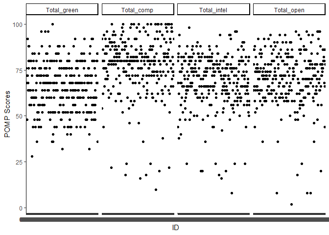
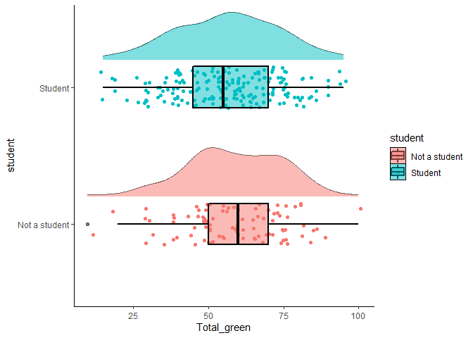

HW3
================
han
2/19/2021

# Homework 03

#### You will analyze data looking at the relationship between **green reputation** and three personality traits–**compassion**, **intellectual curiosity**, and **openness to experiences**.

The dataset includes data from **students** and **non-students**.

## For your assignment, do the following.

### Q1: Inspect the item responses (e.g., with graphs or by summarizing distinct values).

``` r
# Is anything unusual?

filter(green_data, id == 5549) #Searches id for value "5549" 
```

    ## # A tibble: 2 x 37
    ##   id    green1 green2 green3 green4 green5 comp1 comp2 comp3 comp4 comp5 comp6
    ##   <chr>  <dbl>  <dbl>  <dbl>  <dbl>  <dbl> <dbl> <dbl> <dbl> <dbl> <dbl> <dbl>
    ## 1 5549       3      4      4      4      3     4     2     4     4     4     4
    ## 2 5549       4      2      4      3      4     4     5     4     5     5     1
    ## # ... with 25 more variables: comp7 <dbl>, comp8 <dbl>, comp9 <dbl>,
    ## #   comp10 <dbl>, intel1 <dbl>, intel2 <dbl>, intel3 <dbl>, intel4 <dbl>,
    ## #   intel5 <dbl>, intel6 <dbl>, intel7 <dbl>, intel8 <dbl>, intel9 <dbl>,
    ## #   intel10 <dbl>, open1 <dbl>, open2 <dbl>, open3 <dbl>, open4 <dbl>,
    ## #   open5 <dbl>, open6 <dbl>, open7 <dbl>, open8 <dbl>, open9 <dbl>,
    ## #   open10 <dbl>, student <dbl>

``` r
#Quick summary check
green_data.melt <- melt(green_data, measures.var = across(c:green1:open10)) #Reformat dataset, sets all columns into 1 column to separate as factors
```

    ## Using id as id variables

``` r
ggplot(green_data.melt) +
  aes(y = value,
      x = id
      ) +
  geom_point()
```

    ## Warning: Removed 2930 rows containing missing values (geom_point).

<!-- -->

``` r
summary(green_data.melt)
```

    ##       id               variable         value        
    ##  Length:13428       green1 :  373   Min.   :-99.000  
    ##  Class :character   green2 :  373   1st Qu.:  2.000  
    ##  Mode  :character   green3 :  373   Median :  3.000  
    ##                     green4 :  373   Mean   :  2.837  
    ##                     green5 :  373   3rd Qu.:  4.000  
    ##                     comp1  :  373   Max.   :  5.000  
    ##                     (Other):11190   NA's   :2930

``` r
#Dataset has several issues.
#1. Duplicate participant data
#2. Certain data values are off (e.g., -99)
```

### Q2: Compute total scores for the four scales.

``` r
# Recode variables as needed.

#RECODING
temp_recode <- dictionary %>% #Temporary array of names to be used later
  pull(Item) #Array of names are pulled from the list of values under the "item" column

reverse_recode <- dictionary %>% #Separate temporary array of names to be used later
  filter(Keying == -1 | Keying == -2) %>% #Filters the list by the reverse codes (based off dictionary)
  pull(Item) 

#Dataset for Q2, recodes original dataset "green_data"
Q2set <- green_data %>% 
  mutate( 
    across(all_of(temp_recode), #Recodes across all the columns that match the temp_recode list
           ~ na_if(.x, 
                   -99
                   ) #All values that are -99 are recoded into NA
           )
    ) %>% 
  mutate(
    id2 = ifelse(duplicated(id), #Creates new id list and discriminates repeated ID numbers
                 paste0(id,
                        "r"
                        ), #renames duplicate ids  as "id"r
                 id
                 )
    ) %>% 
  mutate(
    across(all_of(reverse_recode),
           ~ recode(.x, 
                    "5" = 1, 
                    "4" = 2, 
                    "3" = 3, 
                    "2" = 4, 
                    "1" = 5
                    )
           )
    ) #Reverse codes based off the dictionary (reverse_recode)

#Rechecking quick summary glance
Q2.melt <- melt(Q2set, 
                measures.var = across(c:green1:open10)
                )
```

    ## Using id, id2 as id variables

``` r
ggplot(Q2.melt) +
  aes(y = value,
      x = id
      ) +
  geom_point()
```

    ## Warning: Removed 2966 rows containing missing values (geom_point).

<!-- -->

``` r
summary(Q2.melt) 
```

    ##       id                id2               variable         value      
    ##  Length:13428       Length:13428       green1 :  373   Min.   :1.000  
    ##  Class :character   Class :character   green2 :  373   1st Qu.:3.000  
    ##  Mode  :character   Mode  :character   green3 :  373   Median :4.000  
    ##                                        green4 :  373   Mean   :3.603  
    ##                                        green5 :  373   3rd Qu.:4.000  
    ##                                        comp1  :  373   Max.   :5.000  
    ##                                        (Other):11190   NA's   :2966

``` r
#Print out summary statistics
Q2set %>% 
  rowwise() %>% #By row
  group_by(id2) %>% #By id
  mutate(
    Total_green = sum(c_across(green1 : green5), #Summary - sum of all green (20), comp, intel, and open (50)
                      na.rm = TRUE
                      ), 
    Total_comp = sum(c_across(comp1 : comp10), 
                     na.rm = TRUE
                     ),
    Total_intel = sum(c_across(intel1 : intel10), 
                      na.rm = TRUE
                      ),
    Total_open = sum(c_across(open1 : open10), 
                     na.rm = TRUE
                     )
    ) %>% 
  select(id2,
         Total_green,
         Total_comp,
         Total_intel,
         Total_open
         )
```

    ## # A tibble: 373 x 5
    ## # Groups:   id2 [373]
    ##    id2   Total_green Total_comp Total_intel Total_open
    ##    <chr>       <dbl>      <dbl>       <dbl>      <dbl>
    ##  1 9099           20         37          28         35
    ##  2 6275           11         48          35         31
    ##  3 8116           20         44          36         39
    ##  4 8586           19         46          30         39
    ##  5 0406           19         40          37         37
    ##  6 5645           18         42          38         38
    ##  7 3788            9         30          30         30
    ##  8 8424           13         19          43         18
    ##  9 8450           18         42          40         39
    ## 10 0512           22         38          37         38
    ## # ... with 363 more rows

### Q3: Rescale the variables so that they go from 0-100 instead of the original range.

``` r
# Name the recaled variables `*_pomp`.

#Dataset for Q3
Q3set <- Q2set %>% 
  mutate(
    across(c(green1 : green5), #Change for green data
           ~.x * 4, #Multiply green data by 4 (Total equals 100)
           .names = "{.col}_pomp" #creates new columns for ^^ named *column*_pomp
           )  
    ) %>% 
  mutate(
    across(c(comp1 : open10),
           ~.x * 2, #Same as before but multiply rest by 2 (Total equal 100)
           .names = "{.col}_pomp"
           )
    )

#Create summary table for question (Same as Q2set.1 but with 100 as total)
Q3set_Final <- Q3set %>% 
  rowwise() %>%
  group_by(id2) %>% 
  mutate(
    Total_green = sum(c_across(green1_pomp : green5_pomp), 
                      na.rm = TRUE
                      ),
    Total_comp = sum(c_across(comp1_pomp : comp10_pomp), 
                     na.rm = TRUE
                     ),
    Total_intel = sum(c_across(intel1_pomp : intel10_pomp), 
                      na.rm = TRUE
                      ),
    Total_open = sum(c_across(open1_pomp : open10_pomp), 
                     na.rm = TRUE
                     )
    ) %>% 
  select(id2,
         Total_green,
         Total_comp,
         Total_intel,
         Total_open
         )

Q3set_Final
```

    ## # A tibble: 373 x 5
    ## # Groups:   id2 [373]
    ##    id2   Total_green Total_comp Total_intel Total_open
    ##    <chr>       <dbl>      <dbl>       <dbl>      <dbl>
    ##  1 9099           80         74          56         70
    ##  2 6275           44         96          70         62
    ##  3 8116           80         88          72         78
    ##  4 8586           76         92          60         78
    ##  5 0406           76         80          74         74
    ##  6 5645           72         84          76         76
    ##  7 3788           36         60          60         60
    ##  8 8424           52         38          86         36
    ##  9 8450           72         84          80         78
    ## 10 0512           88         76          74         76
    ## # ... with 363 more rows

### Q4: Make plots that illustrate the distributions of the 4 POMP-scored variables.

``` r
#Reformats dataset to have all the categories as a factor for easier graph (same as before)
Q4set <- melt(Q3set_Final, 
              value.name = "POMP_scores", 
              variable.name = "POMP_variables"
              )
```

    ## Using id2 as id variables

``` r
summary(Q4set)
```

    ##      id2                POMP_variables  POMP_scores    
    ##  Length:1492        Total_green:373    Min.   :  0.00  
    ##  Class :character   Total_comp :373    1st Qu.: 48.00  
    ##  Mode  :character   Total_intel:373    Median : 68.00  
    ##                     Total_open :373    Mean   : 56.84  
    ##                                        3rd Qu.: 80.00  
    ##                                        Max.   :100.00

``` r
#Creates plot based off Q4set
ggplot(Q4set) + 
  aes(x = id2, 
      y = POMP_scores
      ) + 
  facet_grid(~ POMP_variables) + #Split by POMP_variables
  geom_point() +
  scale_x_discrete("ID") +
  scale_y_continuous("POMP Scores")
```

<!-- -->

``` r
#This graph shows that most of participant scores for all four scales are above half. 
#One possiblity is that these scales are positively correlated to one another. 
#At first glance, this graph shows that, there are more high total score values for comp than rest. 
#Additionally, the graph shows that there are more low total score values for green than the rest.
```

### Q5: Make scatterplots showing the relationships between **green reputation** and each personality trait.

``` r
# Include trend lines for **students** and **non-students**.
# What do these plots show?

#Dataset for Q5
Q5set <- Q3set %>% 
  rowwise() %>%
  group_by(id2) %>% 
  mutate(
    Total_green = sum(c_across(green1_pomp : green5_pomp), 
                      na.rm = TRUE
                      ),
    Total_comp = sum(c_across(comp1_pomp : comp10_pomp), 
                     na.rm = TRUE
                     ),
    Total_intel = sum(c_across(intel1_pomp : intel10_pomp), 
                      na.rm = TRUE
                      ),
    Total_open = sum(c_across(open1_pomp : open10_pomp), 
                     na.rm = TRUE
                     )
    ) %>% 
  select(id2,
         Total_green,
         Total_comp,
         Total_intel,
         Total_open,
         student
         )

Q5set.1 <- Q5set %>%  
  mutate(
    student = recode(student, 
                     "1" = "Not a student", 
                     "2" = "Student", 
                     .default = "No Response", 
                     .missing = "No Response"
                     )
    ) #Recode to student and not a student

#3 scatter plots of student, not a student and no responses
a <- ggplot(Q5set.1) +
  aes(x = Total_green,
      y = Total_comp, 
      color = student
      ) +
  geom_point() +
  scale_color_manual(values = c("black", 
                                "red", 
                                "blue"
                                )
                     ) +
  geom_smooth(method = "lm") #Produces lm line in the graph

b <- ggplot(Q5set.1) +
  aes(x = Total_green,
      y = Total_intel, 
      color = student
      ) +
  geom_point() +
  scale_color_manual(values = c("black", 
                                "red", 
                                "blue"
                                )
                     ) +
  geom_smooth(method = "lm")

c <- ggplot(Q5set.1) +
  aes(x = Total_green,
      y = Total_open,  
      color = student
      ) +
  geom_point() +
  scale_color_manual(values = c("black", 
                                "red", 
                                "blue"
                                )
                     ) +
  geom_smooth(method = "lm")

#Same dataset as last one but removed all NA and incorrect data
Q5set.2 <- Q5set %>% 
  mutate(
    student = recode(student, 
                     "1" = "Not a student", 
                     "2" = "Student"
                     )
    )

#Same plots as last time but without NA and incorrect data
d <- ggplot(data = subset(Q5set.2, 
                          !is.na(student)
                          )
            ) +
  aes(x = Total_green,
      y = Total_comp, 
      color = student
      ) +
  scale_color_manual(values = c("red", 
                                "blue"
                                )
                     ) +
  geom_point() +
  geom_smooth(method = "lm")

e <- ggplot(data = subset(Q5set.2, 
                          !is.na(student)
                          )
            ) +
  aes(x = Total_green,
      y = Total_intel, 
      color = student
      ) +
  scale_color_manual(values = c("red", 
                                "blue"
                                )
                     ) +
  geom_point() +
  geom_smooth(method = "lm")

f <- ggplot(data = subset(Q5set.2, 
                          !is.na(student)
                          )
            ) +
  aes(x = Total_green,
      y = Total_open, 
      color = student
      ) +
  scale_color_manual(values = c("red", 
                                "blue"
                                )
                     ) +
  geom_point() +
  geom_smooth(method = "lm") 


grid.arrange(a,
             b,
             c,
             d,
             e,
             f, 
             nrow = 2
             )#Merges all the graphs into 1 image
```

    ## `geom_smooth()` using formula 'y ~ x'
    ## `geom_smooth()` using formula 'y ~ x'
    ## `geom_smooth()` using formula 'y ~ x'
    ## `geom_smooth()` using formula 'y ~ x'
    ## `geom_smooth()` using formula 'y ~ x'
    ## `geom_smooth()` using formula 'y ~ x'


``` r
# Based only from the graphs, there seem to be a potential positive correlation between the green trait survey and each of the other personality trait surveys. 
#Additionally the graphs show interactions between the green survey and both intel personality trait survey and the open personality trait survey. 
#When comparing the scores between student, non-student and people who did not answer (no response), there is a difference in the scaling and scores between the people who did not respond and those who did.
#Those who did not respond seem to show a lower total score value for all of the personality traits but higher scaling (i.e., larger increase in personality trait total score value per total score value for the green survey).
```

### Q6: Compare **green reputation** for students and non-students using a **rainfall plot** (bar + density + data points).

``` r
ggplot(data = subset(Q5set.2, 
                          !is.na(student)
                     )
       ) +
  aes(x = Total_green, 
      fill = student,
      group = student,
      alpha = student,
      color = student
      ) +
  scale_color_manual(values = c("red", 
                                "blue"
                               )
                     ) +
  scale_fill_manual(values = c("red2",
                               "aquamarine"
                               )
                    ) +
  geom_histogram(position = "identity",
                 binwidth = 1.5,
                 aes(y = ..density.., 
                     alpha = .4
                     )
                 ) +
  geom_density(alpha = .2)
```

<!-- -->

``` r
#Overall, the plot does not seem to indicate a notable difference between students and non-students for the green reputation scale.
```

### Q7: Compute a summary table of means, SDs, medians, minima, and maxima for the four total scores for students and non-students.

``` r
Q5set.1 %>%
  group_by(student) %>% 
  summarize(across(c(Total_green:Total_open),
                    list(Mu = ~ mean(.x,
                                      na.rm = TRUE
                                     ),
                         Sigma = ~ sd(.x,
                                      na.rm = TRUE
                                     ),
                         Median = ~ median(.x,
                                           na.rm = TRUE
                                           ),
                         Max = ~ max(.x, 
                                     na.rm = TRUE
                                     ),
                         Min = ~ min(.x, 
                                     na.rm = TRUE
                                     )
                         )
                   )
            )
```

    ## # A tibble: 3 x 21
    ##   student Total_green_Mu Total_green_Sig~ Total_green_Med~ Total_green_Max
    ## * <chr>            <dbl>            <dbl>            <dbl>           <dbl>
    ## 1 No Res~           25.8             33.1                0              92
    ## 2 Not a ~           66.9             13.2               68             100
    ## 3 Student           65.1             13.7               64              96
    ## # ... with 16 more variables: Total_green_Min <dbl>, Total_comp_Mu <dbl>,
    ## #   Total_comp_Sigma <dbl>, Total_comp_Median <dbl>, Total_comp_Max <dbl>,
    ## #   Total_comp_Min <dbl>, Total_intel_Mu <dbl>, Total_intel_Sigma <dbl>,
    ## #   Total_intel_Median <dbl>, Total_intel_Max <dbl>, Total_intel_Min <dbl>,
    ## #   Total_open_Mu <dbl>, Total_open_Sigma <dbl>, Total_open_Median <dbl>,
    ## #   Total_open_Max <dbl>, Total_open_Min <dbl>

``` r
#Judging purely by the summary statistics, there does not seem to be a difference between students and non-students for any of the personality trait scores (with the possible exception for the mean total score value for comp) or the green reputation scores. 
#Nearly all the means between the two groups are the same and around 70 for the scores, with the exception of comp (76-81) and green (65-67)
```

In your assignment, prepare an RMarkdown file that includes both the
coding and (for 4-7) narrative descriptions of your results.
