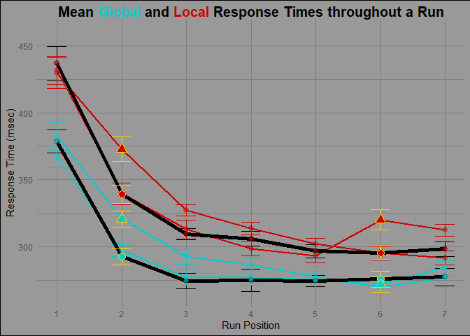

Final Project
================
Han
4/13/2021

# Repeated exposure effects on Global Precedence

## Introduction and Overall Study Description and Report

This study aimed to test the endurance of global level influence on
local level processing. Research has shown that the global level, or the
large form, of an object can influence how the local level, or detailed
components, of the object is visually processed. When the two levels are
congruent ( consistent information between the two levels), global
information can facilitate local information processing; however, when
incongruent (inconsistent information between the two levels), global
information can impede local information processing, leading to slower
response times. The current literature presents inconsistent findings on
whether attention can reduce global level influence. Repeated
presentation to a

## Summary Tables/Datasets

Importing “cleaned” datasets created from “Import\_data\_RE.rmd”

``` r
#Importing cleaned dataset for LME modeling/analysis
REdat.full <-read_csv(here::here("Analyses", "LME", "Data", "RE_Cleaned_data.csv"),
                    col_types = cols(
                      ID = col_factor(),
                      Condition = col_character(),
                      RunPosition = col_factor(),
                      RT = col_double(),
                      Globality = col_character(),
                      RunType = col_character(),
                      StimuliType = col_character()
                      ),
                    na = c("","NA")
                    ) 

#Importing summarized means (by ID) dataset                    
REdat.means <- read_csv(here::here("Analyses", "LME", "Output", "Summary", "Mean_by_condition-id-conditiontype.csv")
                )
```

Summary table that consolidates previous summarized means (by ID) into a
dataset with total summarized means; used for by condition comparisons.
**Used for run graph**

``` r
#Summary table that consolidates previous summarized means (by ID) into a dataset with total summarized means; used for by condition comparisons.
REdat.totalmeans <- summarySEwithin(
  REdat.means,
  measurevar = "RT_Mu",
  withinvars = c("Globality", "RunType", 
                 "RunPosition","Condition", "StimuliType", "Critdatpoint"),
  idvar = "ID")

REdat.totalmeans %>% 
  select(Condition, RunPosition, RT_Mu, sd, se, N)
```

    ##                  Condition RunPosition    RT_Mu       sd        se  N
    ## 1         Global Congruent           1 378.5545 48.20714  8.801380 30
    ## 2         Global Congruent           2 292.6667 33.67630  6.148423 30
    ## 3         Global Congruent           3 274.3681 30.94721  5.650162 30
    ## 4         Global Congruent           4 275.0041 45.65191  8.334861 30
    ## 5         Global Congruent           5 274.4210 21.98076  4.013119 30
    ## 6         Global Congruent           6 275.7711 32.92569  6.011381 30
    ## 7         Global Congruent           7 277.4677 35.62640  6.504462 30
    ## 8  Global Incongruent at 2           1 382.3373 56.15387 10.252247 30
    ## 9  Global Incongruent at 2           2 320.7453 32.41325  5.917824 30
    ## 10 Global Incongruent at 2           3 292.5639 29.61717  5.407330 30
    ## 11 Global Incongruent at 2           4 286.3916 28.70240  5.240317 30
    ## 12 Global Incongruent at 2           5 277.6783 35.15846  6.419027 30
    ## 13 Global Incongruent at 2           6 269.4925 27.01257  4.931798 30
    ## 14 Global Incongruent at 2           7 277.0389 30.91320  5.643953 30
    ## 15 Global Incongruent at 6           1 367.1719 45.43416  8.295105 30
    ## 16 Global Incongruent at 6           2 297.1639 24.94077  4.553541 30
    ## 17 Global Incongruent at 6           3 277.1017 32.37371  5.910603 30
    ## 18 Global Incongruent at 6           4 277.0328 30.99414  5.658730 30
    ## 19 Global Incongruent at 6           5 275.4397 31.13312  5.684105 30
    ## 20 Global Incongruent at 6           6 271.7297 31.77930  5.802079 30
    ## 21 Global Incongruent at 6           7 284.1352 29.11491  5.315631 30
    ## 22         Local Congruent           1 436.8359 69.94123 12.769464 30
    ## 23         Local Congruent           2 338.9235 36.18863  6.607109 30
    ## 24         Local Congruent           3 309.3239 23.53182  4.296303 30
    ## 25         Local Congruent           4 305.8997 29.39395  5.366576 30
    ## 26         Local Congruent           5 296.6270 27.76983  5.070055 30
    ## 27         Local Congruent           6 295.3811 26.74630  4.883185 30
    ## 28         Local Congruent           7 298.2035 29.97613  5.472867 30
    ## 29  Local Incongruent at 2           1 429.3914 62.82007 11.469322 30
    ## 30  Local Incongruent at 2           2 372.8393 49.78924  9.090230 30
    ## 31  Local Incongruent at 2           3 327.1639 23.23527  4.242161 30
    ## 32  Local Incongruent at 2           4 313.3988 25.76170  4.703420 30
    ## 33  Local Incongruent at 2           5 302.0463 22.06088  4.027748 30
    ## 34  Local Incongruent at 2           6 295.0468 27.48894  5.018772 30
    ## 35  Local Incongruent at 2           7 291.4363 28.54655  5.211863 30
    ## 36  Local Incongruent at 6           1 431.5999 56.33097 10.284581 30
    ## 37  Local Incongruent at 6           2 339.5070 44.44613  8.114716 30
    ## 38  Local Incongruent at 6           3 312.9579 38.14379  6.964071 30
    ## 39  Local Incongruent at 6           4 298.5213 30.57965  5.583056 30
    ## 40  Local Incongruent at 6           5 293.0070 28.18577  5.145994 30
    ## 41  Local Incongruent at 6           6 319.8721 41.37616  7.554218 30
    ## 42  Local Incongruent at 6           7 312.3963 24.28078  4.433044 30

Full dataset with only comparison data (Incongruent stimulus at Position
2 and 6, and the congruent stimulus at the same positions from the all
congruent runs) **Used for LME analyses**

``` r
#Filter to look at critical data points
REdat.analysis <- REdat.full %>% 
  filter(((Condition == "Global Congruent"| Condition == "Local Congruent") &
                              (RunPosition == "6" | RunPosition== "2")) | 
                              (StimuliType == "Incongruent Stimuli with Target"))

REdat.analysis %>% 
  select(ID, Condition, RunPosition, RT)
```

    ## # A tibble: 4,734 x 4
    ##    ID    Condition               RunPosition    RT
    ##    <fct> <chr>                   <fct>       <dbl>
    ##  1 2     Local Incongruent at 6  6               7
    ##  2 9     Global Congruent        6               7
    ##  3 9     Global Incongruent at 6 6               7
    ##  4 9     Global Congruent        2               7
    ##  5 19    Global Incongruent at 6 6               7
    ##  6 20    Global Congruent        6               7
    ##  7 21    Global Congruent        6               7
    ##  8 21    Global Congruent        2               7
    ##  9 23    Global Congruent        2               7
    ## 10 24    Local Incongruent at 6  6               7
    ## # ... with 4,724 more rows

Mean data (by ID) with only comparison data (Incongruent stimulus at
Position 2 and 6, and the congruent stimulus at the same positions from
the all congruent runs) **Used for ANOVA and pairwise comparison
analyses**

``` r
#Data by full aggregated means
REdat.IDanalysismeans <- REdat.means %>% 
  filter(((Condition == "Global Congruent"| Condition == "Local Congruent") &
                              (RunPosition == "6" | RunPosition== "2")) | 
                              (StimuliType == "Incongruent Stimuli with Target"))

REdat.IDanalysismeans %>% 
  select(ID, Condition, RunPosition, RT_Mu, RT_Sigma, RT_n)
```

    ## # A tibble: 240 x 6
    ##       ID Condition               RunPosition RT_Mu RT_Sigma  RT_n
    ##    <dbl> <chr>                         <dbl> <dbl>    <dbl> <dbl>
    ##  1     1 Global Congruent                  2  395.    126.     20
    ##  2     1 Global Congruent                  6  336.     99.4    20
    ##  3     1 Global Incongruent at 2           2  476.    275.     20
    ##  4     1 Global Incongruent at 6           6  310.    138.     20
    ##  5     1 Local Congruent                   2  436.    117.     19
    ##  6     1 Local Congruent                   6  408.    114.     18
    ##  7     1 Local Incongruent at 2            2  523.    220.     20
    ##  8     1 Local Incongruent at 6            6  454.    143.     20
    ##  9     2 Global Congruent                  2  209.    103.     20
    ## 10     2 Global Congruent                  6  224.     75.3    20
    ## # ... with 230 more rows

## Analyses

ANOVA results

``` r
#ANOVA
aov.ww <- aov(RT_Mu ~ Globality*RunPosition*StimuliType + 
                Error(ID/(Globality*RunPosition*StimuliType)),
              data = REdat.IDanalysismeans)
summary(aov.ww)
```

    ## 
    ## Error: ID
    ##           Df Sum Sq Mean Sq F value Pr(>F)
    ## Residuals  1   9186    9186               
    ## 
    ## Error: ID:Globality
    ##           Df Sum Sq Mean Sq
    ## Globality  1  92768   92768
    ## 
    ## Error: ID:RunPosition
    ##             Df Sum Sq Mean Sq
    ## RunPosition  1  73475   73475
    ## 
    ## Error: ID:StimuliType
    ##             Df Sum Sq Mean Sq
    ## StimuliType  1  14611   14611
    ## 
    ## Error: ID:Globality:RunPosition
    ##                       Df Sum Sq Mean Sq
    ## Globality:RunPosition  1   5136    5136
    ## 
    ## Error: ID:Globality:StimuliType
    ##                       Df Sum Sq Mean Sq
    ## Globality:StimuliType  1   6323    6323
    ## 
    ## Error: ID:RunPosition:StimuliType
    ##                         Df Sum Sq Mean Sq
    ## RunPosition:StimuliType  1   7510    7510
    ## 
    ## Error: ID:Globality:RunPosition:StimuliType
    ##                                   Df Sum Sq Mean Sq
    ## Globality:RunPosition:StimuliType  1   1913    1913
    ## 
    ## Error: Within
    ##                                    Df  Sum Sq Mean Sq F value Pr(>F)  
    ## Globality                           1   14033   14033   2.269 0.1334  
    ## RunPosition                         1   25478   25478   4.119 0.0436 *
    ## StimuliType                         1   11745   11745   1.899 0.1696  
    ## Globality:RunPosition               1      13      13   0.002 0.9632  
    ## Globality:StimuliType               1       6       6   0.001 0.9749  
    ## RunPosition:StimuliType             1     156     156   0.025 0.8741  
    ## Globality:RunPosition:StimuliType   1     162     162   0.026 0.8717  
    ## Residuals                         224 1385614    6186                 
    ## ---
    ## Signif. codes:  0 '***' 0.001 '**' 0.01 '*' 0.05 '.' 0.1 ' ' 1

Linear mixed effects model results

``` r
#Linear mixed effects model
x =lmer(RT ~ Globality + RunPosition + StimuliType + Globality * RunPosition * StimuliType + # Fixed effects
       (1 | ID), # Random effects, nested within subject
     data = REdat.analysis, 
     REML=TRUE) 
summary(x)
```

    ## Linear mixed model fit by REML. t-tests use Satterthwaite's method [
    ## lmerModLmerTest]
    ## Formula: 
    ## RT ~ Globality + RunPosition + StimuliType + Globality * RunPosition *  
    ##     StimuliType + (1 | ID)
    ##    Data: REdat.analysis
    ## 
    ## REML criterion at convergence: 60970
    ## 
    ## Scaled residuals: 
    ##     Min      1Q  Median      3Q     Max 
    ## -2.8795 -0.5608 -0.0964  0.4579 11.0628 
    ## 
    ## Random effects:
    ##  Groups   Name        Variance Std.Dev.
    ##  ID       (Intercept)  4702     68.57  
    ##  Residual             22714    150.71  
    ## Number of obs: 4734, groups:  ID, 30
    ## 
    ## Fixed effects:
    ##                                                                        Estimate
    ## (Intercept)                                                             275.887
    ## GlobalityLocal                                                           19.448
    ## RunPosition2                                                             16.709
    ## StimuliTypeIncongruent Stimuli with Target                               -4.116
    ## GlobalityLocal:RunPosition2                                              26.759
    ## GlobalityLocal:StimuliTypeIncongruent Stimuli with Target                28.583
    ## RunPosition2:StimuliTypeIncongruent Stimuli with Target                  32.550
    ## GlobalityLocal:RunPosition2:StimuliTypeIncongruent Stimuli with Target  -22.715
    ##                                                                        Std. Error
    ## (Intercept)                                                                13.954
    ## GlobalityLocal                                                              8.727
    ## RunPosition2                                                                8.720
    ## StimuliTypeIncongruent Stimuli with Target                                  8.745
    ## GlobalityLocal:RunPosition2                                                12.342
    ## GlobalityLocal:StimuliTypeIncongruent Stimuli with Target                  12.373
    ## RunPosition2:StimuliTypeIncongruent Stimuli with Target                    12.389
    ## GlobalityLocal:RunPosition2:StimuliTypeIncongruent Stimuli with Target     17.524
    ##                                                                              df
    ## (Intercept)                                                              42.140
    ## GlobalityLocal                                                         4697.024
    ## RunPosition2                                                           4697.015
    ## StimuliTypeIncongruent Stimuli with Target                             4697.020
    ## GlobalityLocal:RunPosition2                                            4697.020
    ## GlobalityLocal:StimuliTypeIncongruent Stimuli with Target              4697.021
    ## RunPosition2:StimuliTypeIncongruent Stimuli with Target                4697.029
    ## GlobalityLocal:RunPosition2:StimuliTypeIncongruent Stimuli with Target 4697.018
    ##                                                                        t value
    ## (Intercept)                                                             19.772
    ## GlobalityLocal                                                           2.228
    ## RunPosition2                                                             1.916
    ## StimuliTypeIncongruent Stimuli with Target                              -0.471
    ## GlobalityLocal:RunPosition2                                              2.168
    ## GlobalityLocal:StimuliTypeIncongruent Stimuli with Target                2.310
    ## RunPosition2:StimuliTypeIncongruent Stimuli with Target                  2.627
    ## GlobalityLocal:RunPosition2:StimuliTypeIncongruent Stimuli with Target  -1.296
    ##                                                                        Pr(>|t|)
    ## (Intercept)                                                             < 2e-16
    ## GlobalityLocal                                                          0.02589
    ## RunPosition2                                                            0.05539
    ## StimuliTypeIncongruent Stimuli with Target                              0.63794
    ## GlobalityLocal:RunPosition2                                             0.03020
    ## GlobalityLocal:StimuliTypeIncongruent Stimuli with Target               0.02093
    ## RunPosition2:StimuliTypeIncongruent Stimuli with Target                 0.00864
    ## GlobalityLocal:RunPosition2:StimuliTypeIncongruent Stimuli with Target  0.19498
    ##                                                                           
    ## (Intercept)                                                            ***
    ## GlobalityLocal                                                         *  
    ## RunPosition2                                                           .  
    ## StimuliTypeIncongruent Stimuli with Target                                
    ## GlobalityLocal:RunPosition2                                            *  
    ## GlobalityLocal:StimuliTypeIncongruent Stimuli with Target              *  
    ## RunPosition2:StimuliTypeIncongruent Stimuli with Target                ** 
    ## GlobalityLocal:RunPosition2:StimuliTypeIncongruent Stimuli with Target    
    ## ---
    ## Signif. codes:  0 '***' 0.001 '**' 0.01 '*' 0.05 '.' 0.1 ' ' 1
    ## 
    ## Correlation of Fixed Effects:
    ##             (Intr) GlbltL RnPst2 STISwT GL:RP2 GL:SSwT RP2SwT
    ## GlobaltyLcl -0.312                                           
    ## RunPositin2 -0.312  0.499                                    
    ## StmlTypISwT -0.311  0.498  0.498                             
    ## GlbltyL:RP2  0.221 -0.707 -0.707 -0.352                      
    ## GlbL:STISwT  0.220 -0.705 -0.352 -0.707  0.499               
    ## RnP2:STISwT  0.220 -0.351 -0.704 -0.706  0.497  0.499        
    ## GL:RP2:SSwT -0.155  0.498  0.498  0.499 -0.704 -0.706  -0.707

Pairwise comparison (Planned contrast: Local Incongruent at P2(and 6)
vs. Local congruent at P2(and 6))

``` r
#Pairwise comparison for Local level
pwc <- REdat.IDanalysismeans %>%
  filter(Globality == "Local") %>% 
  group_by(RunPosition) %>% 
  pairwise_t_test(
    RT_Mu ~ StimuliType, paired = TRUE,
    p.adjust.method = "bonferroni"
  )
pwc
```

    ## # A tibble: 2 x 11
    ##   RunPosition .y.   group1 group2    n1    n2 statistic    df     p p.adj
    ## *       <dbl> <chr> <chr>  <chr>  <int> <int>     <dbl> <dbl> <dbl> <dbl>
    ## 1           2 RT_Mu Congr~ Incon~    30    30     -3.62    29 0.001 0.001
    ## 2           6 RT_Mu Congr~ Incon~    30    30     -2.86    29 0.008 0.008
    ## # ... with 1 more variable: p.adj.signif <chr>

## Graphs

Graph depicting total means throughout a run for all conditions

``` r
runplot <- ggplot(data = REdat.totalmeans) +
  aes(x = RunPosition, 
      y = RT_Mu, 
      shape = StimuliType,
      group = interaction(Globality,RunType)) +
  geom_errorbar(aes(ymax = RT_Mu + se, 
                    ymin = RT_Mu - se,
                    color = Condition), 
                width=.3) +
  geom_line(aes(size = Condition,  
                color = Condition)) +
  geom_line(data = subset(REdat.totalmeans,
                        RunType == "Congruent"),
            aes(color = "black",
                size = Condition))+
  geom_point(aes(color = Condition,
                 alpha = Critdatpoint,
                 size = Globality,
                 fill = Globality)) +
  geom_point(data = subset(REdat.totalmeans,
                           RunType == "Congruent"),
                           aes(color = Condition,
                               alpha = Critdatpoint,
                               size = Globality,
                               fill = Globality)) +
  geom_errorbar(data=subset(REdat.totalmeans, 
                            Critdatpoint =="Critical"),
                aes(ymax = RT_Mu + se, 
                    ymin = RT_Mu - se, 
                    color = "gold"), 
                width=.3) +
  geom_point(data = subset(REdat.totalmeans, 
                           Critdatpoint == "Critical"),
             aes(color ="gold", 
                 size = RunType,
                 fill = Globality)) +
  scale_alpha_manual(values=c(1,.4)) +
  scale_color_manual(values = c("black", "black", "cyan3", "cyan3","gold","black","red3","red3")) +
  scale_fill_manual(values = c("cyan3", "red3")) +
  scale_size_manual(values = c(3.5,2.5,2,1,1,3.5,3.5,2.5,2,1,1)) +
  scale_shape_manual(name = "Stimulus", 
                     values = c(21,24), 
                     labels=c("Incongruent Stimulus",
                              "Congruent Stimulus")) +
  scale_x_discrete("Run Position", 
                   1:7,  
                   waiver(),
                   limits = c("1","2","3","4","5","6","7"),
                   expand = c(.05,0)) + 
  ylim(265,460) +
  labs(title = "Mean <span style='color: cyan3'>**Global**</span> and <span style='color: red3'>**Local**</span> Response Times throughout a Run", 
       color ="Critical Position", 
       x ="Run Position", 
       y ="Response Time (msec)") +
  guides(color = FALSE, size = FALSE, alpha = FALSE, shape = FALSE, fill = FALSE) +
  theme_x()

runplot
```

<!-- -->

Assumption graphs (for analyses)

``` r
#Scatterplot + trendlines
scatter = ggplot(REdat.analysis) +
  aes(x = RunPosition, y = RT, color = StimuliType) +
  geom_point() +
    geom_smooth(aes(color=StimuliType, group = StimuliType), 
              method="lm") +
  facet_grid(.~Globality) +
  scale_size_manual(values = c(.5,1,1,1)) +
  scale_x_discrete(expand = c(.05,0)) +
  scale_color_manual(values = c("red","blue")) +
  guides(color = FALSE) +
  theme_x()

#Density plot
dens = ggplot(REdat.analysis) +
  aes(x = RT) +
  facet_grid(.~Globality) +
geom_density(aes(y = (after_stat(count)), 
                 fill = interaction(StimuliType, RunPosition), 
                 alpha  = interaction(StimuliType, RunPosition))) +
    scale_alpha_manual(values = c(.1,.7,.5,.1)) +
    scale_fill_manual(values = c("red","red3","blue","cyan")) + 
  theme_x()

#boxplot
boxplot = REdat.analysis %>% 
  ggplot(mapping = aes(x = RunPosition, y = RT)) +
  geom_boxplot(aes(color = StimuliType)) +
  facet_grid(.~Globality) +
  scale_x_discrete(expand = c(.05,0)) +
  scale_color_manual(values = c("red", "blue")) +
  guides(color = FALSE) +
  theme_x()


scatter  + boxplot + dens +
  plot_layout(ncol = 1, guides = 'collect') +
  plot_annotation(title = "<span style='color: red'>**Congruent**</span> vs. <span style='color: blue'>**Incongruent**</span> RT performance",
                  theme = theme(plot.title = element_markdown(face = "bold"),
                                plot.background = element_rect(fill = "gray")
                                )
                 )
```

<!-- -->
